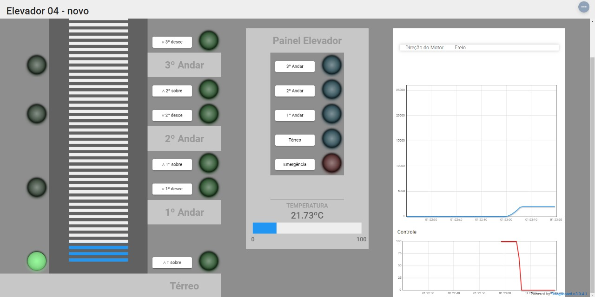
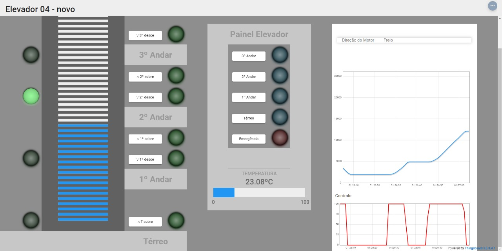
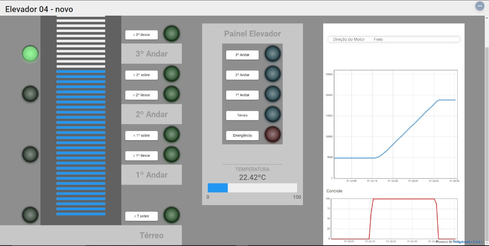
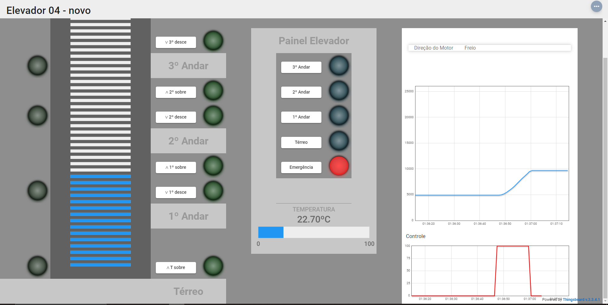

# Requisitos

- WiringPi;
- gcc;
- pthread.

## Compilação

```
make
```
## Execução

```
make run
```

## Limpeza
```
make clean
```

# Testes
### Teste térreo

### Teste 2° andar

### Teste 3° andar

### Teste Emergência 


# Vídeos

<a href="https://www.youtube.com/watch?v=FieWaT5s1zc" target="_blank" style="text-decoration: none;">Demonstração</a>

<a href="https://www.youtube.com/watch?v=edrqHS1ugyU" target="_blank" style="text-decoration: none;">Explicação main/request</a>